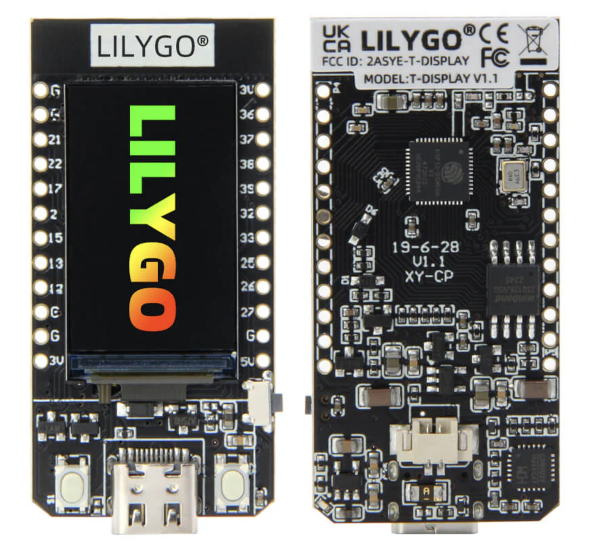
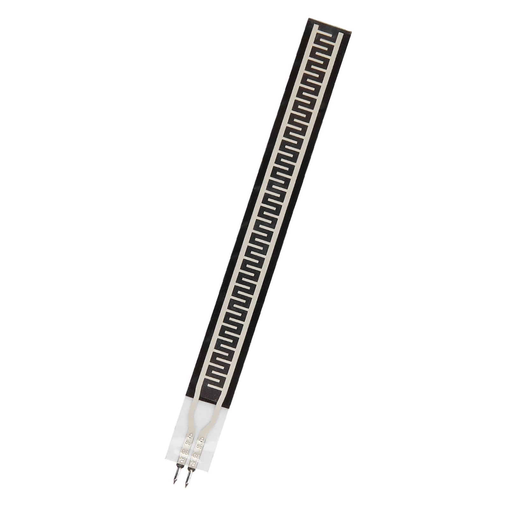
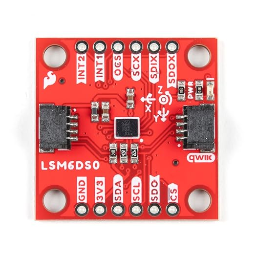

# SignEase
 A sign language glove


## **Table of Contents**
1. [SignEase: A Sign Language Glove](#signease-a-sign-language-glove)
2. [Project Overview](#2-project-overview)
3. [Flow](#3-flow)
4. [Detailed Instructions](#detailed-instructions)
   - [A. Hardware Setup](#1-hardware-setup)
   - [B. Firmware for ESP32](#2-firmware-for-esp32)
   - [C. iPhone App](#3-iphone-app)
   - [D. AWS Backend](#4-aws-backend)
   - [E. Audio Playback on iPhone](#5-audio-playback-on-iphone)
5. [Programming Languages and Frameworks](#6-programming-languages-and-frameworks)
   - [A. For the ESP32 Firmware](#a-for-the-esp32-firmware)
   - [B. For the Mobile App (Flutter)](#b-for-the-mobile-app-flutter)
   - [C. For the AWS Backend](#c-for-the-aws-backend)
   - [D. For AWS Services](#d-for-aws-services)
6. [Tools and Libraries](#7-tools-and-libraries)
7. [Flow of Languages and Tools](#8-flow-of-languages-and-tools)
8. [Parts List](#9-parts-list)
9. [Suggestions for Improvement](#suggestions-for-improvement)

---

### **1. SignEase: A Sign Language Glove**
[Back to Table of Contents](#table-of-contents)

---

### **2. Project Overview**
[Back to Table of Contents](#table-of-contents)

This project involves creating a **smart glove** capable of translating sign language gestures into **audio output**. The glove uses 5 **flex sensors**, an **accelerometer**, and a **gyroscope** to detect hand gestures, interpret the meaning, and determine the tone of the output. The system uses **AWS** for backend processing, integrates with **OpenAI's API** to generate audio responses, and uses an **iPhone** as the client interface for interaction.

---

### **3. Flow**
[Back to Table of Contents](#table-of-contents)

1. **Glove Hardware**:
   - The glove, equipped with **ESP32**, **5 flex sensors**, and a **6-DOF IMU sensor (accelerometer and gyroscope)**, captures the user's hand gestures.
   - Flex sensors measure finger bends.
   - The IMU detects hand orientation and movement intensity.

2. **ESP32 Communication**:
   - The ESP32 processes sensor data and sends it to the **iPhone** via **Bluetooth Low Energy (BLE)**.

3. **iPhone Client**:
   - The iPhone app receives the sensor data, displays the interpreted gesture in text format, and forwards the data to **AWS** for further processing.

4. **AWS Backend**:
   - AWS processes the incoming data:
     - **AWS Lambda** determines the gesture's meaning and constructs a JSON payload.
     - The JSON is sent to the **OpenAI API** for text-to-speech generation, including dynamic tone modulation (e.g., angry, calm).
     - The OpenAI API generates audio in `.wav` format.
     - OpenAI API docs: [OpenAI Docs](https://platform.openai.com/docs/guides/text-to-speech)

5. **Return Data Flow**:
   - The generated audio file and the interpreted text are stored in AWS and sent back to the **iPhone app**.
   - The app displays the text output and provides a button for playing the audio.

---

### **4. Detailed Instructions**
[Back to Table of Contents](#table-of-contents)

#### **A. Hardware Setup**
1. **Components**:
   - **ESP32 TTGO T-Display**: Microcontroller for processing and communication.
   - **5 Flex Sensors**: Mounted on the glove to measure finger bends.
   - Power Supply: A small **LiPo battery** to make the glove portable.

2. **Connections**:
   - Connect the flex sensors to analog-capable GPIO pins on the ESP32 (e.g., GPIO32, GPIO33, GPIO25, GPIO26, GPIO27).
   - Connect the accelerometer/gyroscope via **I2C** (e.g., `SCL` to GPIO22, `SDA` to GPIO21).
   - Wire power connections to the **3.3V pin** and ground to **GND**.

3. **Testing**:
   - Write test code for the ESP32 to ensure it can read sensor values and print them to the serial monitor.

#### **B. Firmware for ESP32**
[Back to Table of Contents](#table-of-contents)

The ESP32 reads the sensors and sends the processed data via **Bluetooth Low Energy (BLE)** to the iPhone.


#### **C. iPhone App**
[Back to Table of Contents](#table-of-contents)

1. **BLE Integration**:
   - Use **Core Bluetooth** to receive sensor data from the ESP32.
   - Parse the received JSON and display the interpreted gesture.

2. **Send Data to AWS**:
   - Use the AWS SDK for iOS to send the processed gesture data to an **AWS API Gateway** endpoint.

3. **Receive Processed Data**:
   - Fetch the text and audio `.wav` file from AWS and display/play it in the app.

#### **D. AWS Backend**
[Back to Table of Contents](#table-of-contents)

1. **AWS IoT Core**:
   - Accept data from the iPhone or directly from the ESP32 if needed.

2. **Lambda Function**:
   - Process incoming sensor data to:
     - Determine the gesture based on flex sensor readings and IMU data.
     - Construct the JSON payload for OpenAI API.

3. **OpenAI API Integration**:
   - Use OpenAI's API to generate text-to-speech output based on the gesture and tone.

4. **Store Audio in S3**:
   - Save the `.wav` file in an S3 bucket for retrieval by the iPhone app.

#### **E. Audio Playback on iPhone**
[Back to Table of Contents](#table-of-contents)

- Use a simple button in the app that fetches the `.wav` file from AWS S3 and plays it using **AVAudioPlayer**.

---

### **5. Suggestions for Improvement**
[Back to Table of Contents](#table-of-contents)

1. **Error Handling**:
   - Include fallback phrases if a gesture cannot be recognized.

2. **Scalability**:
   - Add support for additional gestures or phrases by updating the AWS backend logic.

3. **Real-Time Feedback**:
   - Use WebSocket or MQTT for faster communication between AWS and the iPhone.

---

### **6. Programming Languages and Frameworks**
[Back to Table of Contents](#table-of-contents)

#### **A. For the ESP32 Firmware**
[Back to Table of Contents](#table-of-contents)

- **C/C++**:
  - Required to program the ESP32 microcontroller.
  - Libraries: 
    - `Arduino.h` (for general ESP32 development).
    - `BLEDevice.h` (for Bluetooth Low Energy).
    - `Wire.h` (for I2C communication with the IMU sensor).
  - Platform: Arduino IDE or PlatformIO (in VS Code).

#### **B. For the Mobile App (Flutter)**
[Back to Table of Contents](#table-of-contents)

- **Dart**:
  - Primary language for developing the mobile app in Flutter.
  - Handles:
    - UI design.
    - BLE communication with the ESP32.
    - API calls to AWS for processing data.

- **Flutter Framework**:
  - To build a cross-platform app for both iOS and Android.
  - Plugins required:
    - `flutter_blue`: For BLE communication.
    - `http`: To send data to AWS (e.g., API Gateway).
    - `just_audio`: To play the `.wav` audio file from AWS.

#### **C. For the AWS Backend**
[Back to Table of Contents](#table-of-contents)

- **Python (Recommended)**:
  - To write **AWS Lambda** functions for:
    - Processing data received from the app.
    - Constructing JSON payloads for the OpenAI API.
    - Storing audio files in S3.
  - Libraries: `boto3` (AWS SDK for Python).

- **OpenAI API Integration**:
  - **Python**: Handle OpenAI API requests for text-to-speech generation.

#### **D. For AWS Services**
[Back to Table of Contents](#table-of-contents)

- **JSON**:
  - Used for constructing and parsing data between the app, AWS services, and the OpenAI API.

---

### **7. Tools and Libraries**
[Back to Table of Contents](#table-of-contents)

#### **ESP32 Development**
- **Arduino IDE** or **PlatformIO**:
  - For writing and uploading firmware to the ESP32.
  - Use libraries:
    - `BLEDevice` (Bluetooth Low Energy communication).
    - `Wire` (for I2C).

#### **Flutter Mobile App**
- **Flutter SDK**:
  - Install Flutter and Dart on your development machine.
- Plugins:
  - `flutter_blue`: BLE communication with ESP32.
  - `provider` or `riverpod`: For state management.
  - `http`: To handle REST API communication with AWS.
  - `just_audio`: For audio playback.
  - `json_serializable`: For parsing JSON from AWS and OpenAI.

#### **AWS Services**
- **AWS Lambda**:
  - Python for serverless backend logic.
- **AWS API Gateway**:
  - To create REST API endpoints for the app to send and receive data.
- **AWS IoT Core** (Optional):
  - To connect the ESP32 directly to AWS (if you skip BLE for some data).
- **Amazon S3**:
  - For storing and retrieving `.wav` files.

---

### **8. Flow of Languages and Tools**
[Back to Table of Contents](#table-of-contents)

#### **Hardware/ESP32 (C/C++)**:
- Reads sensor data and sends it via BLE to the Flutter app.

#### **Mobile App (Flutter/Dart)**:
1. Communicates with ESP32 over BLE.
2. Sends sensor data to AWS via REST API (JSON payload).
3. Retrieves text and audio from AWS.
4. Displays text and plays audio.

#### **AWS Backend (Python)**:
1. Receives sensor data via API Gateway.
2. Lambda function processes data and constructs a JSON payload for OpenAI API.
3. Stores `.wav` audio files in S3.
4. Returns JSON response with text and audio file link to the app.

#### **Audio Output and Display (Dart)**:
- Fetches and plays `.wav` files using Flutter plugins.

---


### **Summary of Required Languages**
| **Component**             | **Language** / **Framework**  | **Purpose**                                |
|----------------------------|-------------------------------|--------------------------------------------|
| **ESP32 Firmware**         | C/C++                        | Read sensors, BLE communication.           |
| **Mobile App**             | Dart (Flutter)               | UI, BLE communication, REST API, playback. |
| **AWS Lambda**             | Python (Recommended)         | Process data, OpenAI API, handle audio.    |
| **AWS API Gateway**        | JSON                         | REST API communication.                    |
| **AWS IoT Core (Optional)**| JSON                         | Direct ESP32 to AWS communication.         |
| **Audio Storage**          | AWS S3                       | Store and retrieve `.wav` files.           |
| **Text-to-Speech**         | Python (via OpenAI API)      | Generate text and audio responses.         |


### **9. Parts List**
[Back to Table of Contents](#table-of-contents)


## **Project Overview: Sign Language Glove**
This project involves creating a **smart glove** capable of translating sign language gestures into **audio output**. The glove uses 5 **flex sensors**, an **accelerometer**, and a **gyroscope** to detect hand gestures, interpret the meaning, and determine the tone of the output. The system uses **AWS** for backend processing, integrates with **OpenAI's API** to generate audio responses, and uses an **iPhone** as the client interface for interaction.

---

### **3. Flow**
1. **Glove Hardware**:
   - The glove, equipped with **ESP32**, **5 flex sensors**, and a **6-DOF IMU sensor (accelerometer and gyroscope)**, captures the user's hand gestures.
   - Flex sensors measure finger bends.
   - The IMU detects hand orientation and movement intensity.

2. **ESP32 Communication**:
   - The ESP32 processes sensor data and sends it to the **iPhone** via **Bluetooth Low Energy (BLE)**.

3. **iPhone Client**:
   - The iPhone app receives the sensor data, displays the interpreted gesture in text format, and forwards the data to **AWS** for further processing.

4. **AWS Backend**:
   - AWS processes the incoming data:
     - **AWS Lambda** determines the gesture's meaning and constructs a JSON payload.
     - The JSON is sent to the **OpenAI API** for text-to-speech generation, including dynamic tone modulation (e.g., angry, calm).
     - The OpenAI API generates audio in `.wav` format.

5. **Return Data Flow**:
   - The generated audio file and the interpreted text are stored in AWS and sent back to the **iPhone app**.
   - The app displays the text output and provides a button for playing the audio.

---

### **Detailed Instructions**

#### **1. Hardware Setup**
1. **Components**:
   - **ESP32 TTGO T-Display**: Microcontroller for processing and communication.
   - **5 Flex Sensors**: Mounted on the glove to measure finger bends.
   - **Accelerometer and Gyroscope**: E.g., **MPU6050** for motion tracking.
   - Power Supply: A small **LiPo battery** to make the glove portable.

2. **Connections**:
   - Connect the flex sensors to analog-capable GPIO pins on the ESP32 (e.g., GPIO32, GPIO33, GPIO25, GPIO26, GPIO27).
   - Connect the accelerometer/gyroscope via **I2C** (e.g., `SCL` to GPIO22, `SDA` to GPIO21).
   - Wire power connections to the **3.3V pin** and ground to **GND**.

3. **Testing**:
   - Write test code for the ESP32 to ensure it can read sensor values and print them to the serial monitor.

---

#### **2. Firmware for ESP32**
The ESP32 reads the sensors and sends the processed data via **Bluetooth Low Energy (BLE)** to the iPhone.

#### **3. iPhone App**
1. **BLE Integration**:
   - Use **Core Bluetooth** to receive sensor data from the ESP32.
   - Parse the received JSON and display the interpreted gesture.

2. **Send Data to AWS**:
   - Use the AWS SDK for iOS to send the processed gesture data to an **AWS API Gateway** endpoint.

3. **Receive Processed Data**:
   - Fetch the text and audio `.wav` file from AWS and display/play it in the app.

---

#### **4. AWS Backend**
1. **AWS IoT Core**:
   - Accept data from the iPhone or directly from the ESP32 if needed.

2. **Lambda Function**:
   - Process incoming sensor data to:
     - Determine the gesture based on flex sensor readings and IMU data.
     - Construct the JSON payload for OpenAI API.

3. **OpenAI API Integration**:
   - Use OpenAI's API to generate text-to-speech output based on the gesture and tone.

4. **Store Audio in S3**:
   - Save the `.wav` file in an S3 bucket for retrieval by the iPhone app.

---

#### **5. Audio Playback on iPhone**
- Use a simple button in the app that fetches the `.wav` file from AWS S3 and plays it using **AVAudioPlayer**.

---


### **2. Tools and Libraries**
#### **ESP32 Development**
- **Arduino IDE** or **PlatformIO**:
  - For writing and uploading firmware to the ESP32.
  - Use libraries:
    - `BLEDevice` (Bluetooth Low Energy communication).
    - `Wire` (for I2C).

#### **Flutter Mobile App**
- **Flutter SDK**:
  - Install Flutter and Dart on your development machine.
- Plugins:
  - `flutter_blue`: BLE communication with ESP32.
  - `provider` or `riverpod`: For state management.
  - `http`: To handle REST API communication with AWS.
  - `just_audio`: For audio playback.
  - `json_serializable`: For parsing JSON from AWS and OpenAI.

#### **AWS Services**
- **AWS Lambda**:
  - Python for serverless backend logic.
- **AWS API Gateway**:
  - To create REST API endpoints for the app to send and receive data.
- **AWS IoT Core** (Optional):
  - To connect the ESP32 directly to AWS (if you skip BLE for some data).
- **Amazon S3**:
  - For storing and retrieving `.wav` files.

---

### **3. Flow of Languages and Tools**
#### **Hardware/ESP32 (C/C++)**:
- Reads sensor data and sends it via BLE to the Flutter app.

#### **Mobile App (Flutter/Dart)**:
1. Communicates with ESP32 over BLE.
2. Sends sensor data to AWS via REST API (JSON payload).
3. Retrieves text and audio from AWS.
4. Displays text and plays audio.

#### **AWS Backend (Python)**:
1. Receives sensor data via API Gateway.
2. Lambda function processes data and constructs a JSON payload for OpenAI API.
3. Stores `.wav` audio files in S3.
4. Returns JSON response with text and audio file link to the app.

#### **Audio Output and Display (Dart)**:
- Fetches and plays `.wav` files using Flutter plugins.

---

### **Summary of Required Languages**
| **Component**             | **Language** / **Framework**  | **Purpose**                                |
|----------------------------|-------------------------------|--------------------------------------------|
| **ESP32 Firmware**         | C/C++                        | Read sensors, BLE communication.           |
| **Mobile App**             | Dart (Flutter)               | UI, BLE communication, REST API, playback. |
| **AWS Lambda**             | Python (Recommended)         | Process data, OpenAI API, handle audio.    |
| **AWS API Gateway**        | JSON                         | REST API communication.                    |
| **AWS IoT Core (Optional)**| JSON                         | Direct ESP32 to AWS communication.         |
| **Audio Storage**          | AWS S3                       | Store and retrieve `.wav` files.           |
| **Text-to-Speech**         | Python (via OpenAI API)      | Generate text and audio responses.         |

---


### **Parts List**
### **1. Core Components**
#### **Microcontroller**
- **ESP32 TTGO T-Display** (or equivalent ESP32 board):

  - Features: Built-in Wi-Fi and Bluetooth for AWS and BLE communication.
  - Optional: ESP32 board without a display if you don’t need visual output.

#### **Sensors**
1. **Flex Sensors** (5 pcs):

   - Measures the bending of fingers.
   - Length depends on glove size and desired sensitivity.

2. **IMU Sensor** (1 pc):

   - Combines an accelerometer and gyroscope for hand movement tracking.
   - Example: **MPU6050** or **MPU9250** (I2C communication).


### **2. Supporting Components**
#### **Power Supply**
1. **LiPo Battery**:
   - Example: 3.7V **1000mAh** (or higher capacity for longer usage).
   - Ensure it fits on the glove and provides sufficient runtime.

2. **Battery Charging Module**:
   - Example: **TP4056 LiPo Charger** for recharging the battery.

#### **Resistors**
1. **10kΩ Resistors** (5 pcs):
   - For voltage divider circuits with flex sensors.

#### **Wires and Connectors**
1. **Jumper Wires**:
   - Female-to-male or female-to-female for connecting sensors to the ESP32.

2. **Conductive Thread (Optional)**:
   - For creating flexible, sewable connections on the glove.

#### **Breadboard or PCB**
1. **Small Breadboard** (Optional):
   - For initial prototyping of circuits.
2. **Prototype PCB** (1 pc):
   - For soldering the final connections.


### **3. Glove**
1. **Base Glove**:
   - Example: Sports or cycling gloves with snug fit.
   - Material: Comfortable and durable enough to mount sensors.


### **4. Tools**
1. **Soldering Kit**:
   - Soldering iron, solder wire, and flux for permanent connections.

2. **Multimeter**:
   - For testing connections and sensor functionality.

3. **Wire Stripper/Cutter**:
   - For preparing wires.

4. **Heat Shrink Tubing or Electrical Tape**:
   - For securing and insulating connections.

5. **Hot Glue Gun (Optional)**:
   - For attaching sensors and components securely to the glove.

6. **AWS Integration**:
No physical components are required for AWS integration, as this is software-based. The ESP32’s Wi-Fi module handles all communication with AWS.

### **5. Optional Components**
#### **External Display**
1. **OLED Display** (Optional):
   - Example: 0.96-inch I2C OLED.
   - Use if you want visual feedback directly on the glove.

#### **Haptic Feedback**
1. **Vibration Motor** (Optional):
   - For tactile feedback when a gesture is recognized.

| **Component**                  | **Quantity** | **Estimated Cost** (USD) |
|--------------------------------|--------------|---------------------------|
| ESP32 TTGO T-Display           | 1            | $15–$20                  |
| Flex Sensors (4.5")            | 5            | $60–$100 (total)         |
| MPU6050 IMU Sensor             | 1            | $5–$10                   |
| LiPo Battery (3.7V, 1000mAh)   | 1            | $10–$15                  |
| TP4056 LiPo Charger            | 1            | $2–$5                    |
| 10kΩ Resistors                 | 5            | <$1                      |
| Jumper Wires                   | 20+          | $5–$10                   |
| Glove                  | 1                    | $10–$20                  |
| Soldering Kit                  | 1            | $20–$40                  |
| Multimeter                     | 1            | $10–$20                  |
| Breadboard                     | 1 (Optional) | $5–$10                   |
| Heat Shrink Tubing             | Pack         | $5–$10                   |
| Hot Glue Gun                   | 1 (Optional) | $10–$15                  |


---


### **Suggestions for Improvement**
1. **Error Handling**:
   - Include fallback phrases if a gesture cannot be recognized.

2. **Scalability**:
   - Add support for additional gestures or phrases by updating the AWS backend logic.

3. **Real-Time Feedback**:
   - Use WebSocket or MQTT for faster communication between AWS and the iPhone.


### **1. Programming Languages and Frameworks**
#### **A. For the ESP32 Firmware**
- **C/C++**:
  - Required to program the ESP32 microcontroller.
  - Libraries: 
    - `Arduino.h` (for general ESP32 development).
    - `BLEDevice.h` (for Bluetooth Low Energy).
    - `Wire.h` (for I2C communication with the IMU sensor).
  - Platform: Arduino IDE or PlatformIO (in VS Code).


#### **B. For the Mobile App (Flutter)**
- **Dart**:
  - Primary language for developing the mobile app in Flutter.
  - Handles:
    - UI design.
    - BLE communication with the ESP32.
    - API calls to AWS for processing data.

- **Flutter Framework**:
  - To build a cross-platform app for both iOS and Android.
  - Plugins required:
    - `flutter_blue`: For BLE communication.
    - `http`: To send data to AWS (e.g., API Gateway).
    - `just_audio`: To play the `.wav` audio file from AWS.


#### **C. For the AWS Backend**
- **Python (Recommended)**:
  - To write **AWS Lambda** functions for:
    - Processing data received from the app.
    - Constructing JSON payloads for the OpenAI API.
    - Storing audio files in S3.
  - Libraries: `boto3` (AWS SDK for Python).

- **OpenAI API Integration**:
  - **Python**: Handle OpenAI API requests for text-to-speech generation.


#### **D. For AWS Services**
- **JSON**:
  - Used for constructing and parsing data between the app, AWS services, and the OpenAI API.

---

### **Summary**
This setup provides everything needed to build, test, and operate the glove. Optional items like displays or vibration motors can enhance functionality, but they are not necessary for the core project.

---


### **Troubleshooting**
- **Flex Sensor Sensitivity**:
  - **Problem**: The flex sensors are too sensitive, causing unintended or exaggerated readings.
  - **Solutions**:
    1. **Adjust Resistor Value**:
       - Increase the fixed resistor in the voltage divider circuit (e.g., from 10kΩ to 20kΩ or 47kΩ) to reduce the output voltage range and sensitivity.
    2. **Add a Capacitor**:
       - Place a capacitor (e.g., 0.1µF or 1µF) in parallel with the sensor output to smooth voltage fluctuations and dampen rapid changes.
    3. **Software Filtering**:
       - Implement a moving average or low-pass filter in code to smooth out the sensor readings. Example:
       ```c
       const int numReadings = 10;
       int readings[numReadings];
       int readIndex = 0;
       int total = 0;
       int average = 0;

       void setup() {
         for (int i = 0; i < numReadings; i++) {
           readings[i] = 0;
         }
       }

       void loop() {
         total = total - readings[readIndex];
         readings[readIndex] = analogRead(A0);  // Replace A0 with your sensor pin
         total = total + readings[readIndex];
         readIndex = (readIndex + 1) % numReadings;
         average = total / numReadings;

         Serial.println(average); // Smoothed output
       }
       ```
    4. **Set Thresholds**:
       - Ignore minor changes in the sensor value by applying a threshold. For example:
       ```c
       int sensorValue = analogRead(A0);
       if (abs(sensorValue - previousValue) > threshold) {
         // Process the change
       }
       previousValue = sensorValue;
       ```
       - Adjust the `threshold` value (e.g., 10–50) based on your needs.
    5. **Physical Placement**:
       - Ensure the flex sensors are securely attached and not under constant strain.
       - Add a physical buffer (e.g., foam or padding) to reduce responsiveness to minor bends.


## Setup Instructions
### ESP32 Firmware
1. Navigate to the `esp32-firmware/` directory.
2. Open the project in PlatformIO or Arduino IDE.
3. Upload the code to the ESP32 board.

### Mobile App
1. Navigate to the `mobile-app/` directory.
2. Open the project in Flutter.
3. Run `flutter pub get` to install dependencies.
4. Build and run the app.

### AWS Backend
1. Navigate to the `aws-backend/` directory.
2. Deploy the Lambda functions using AWS CLI or your preferred tool.
3. Update the API Gateway endpoint in the mobile app configuration.

## Contributions
Feel free to contribute by submitting pull requests.
